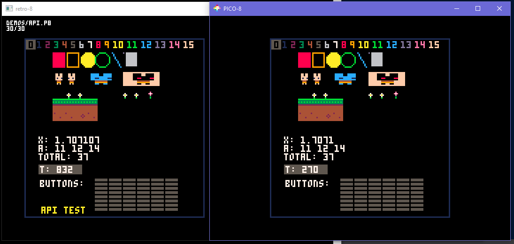
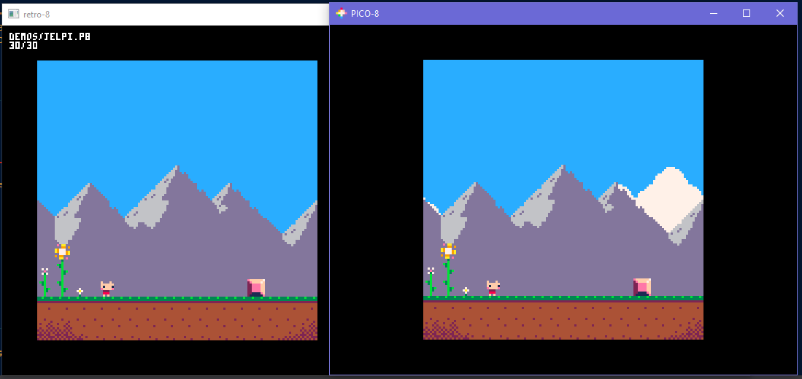
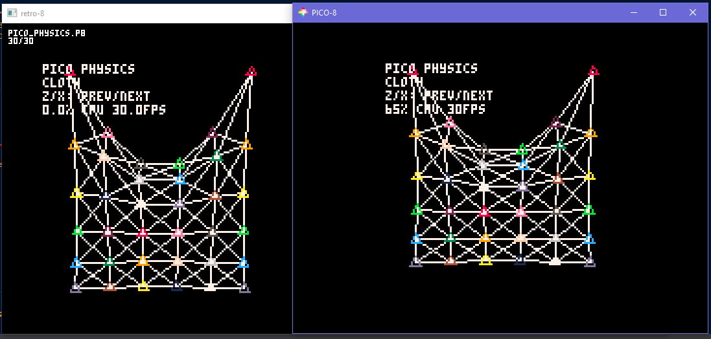

## Introduction

This is an attempt to have an open source reimplementation of PICO-8 fantasy console to be used on Desktop platforms but especially wherever you want to compile it.

It was born as an attempt to make PICO-8 games playable on OpenDingux devices (GCW0, RG350, ..).
Currently working to port it as a RetroArch core.

## Implementation

The emulator is written in C++11 and embeds Lua source code (to allow extensions to the language that PICO-8 has). It currently requires SDL2 but a SDL1.2 backend will be made too.

## Status

Currently much of the API is already working with good performance, even basic sound and music are working.

Many demos already work and even some full games.

- All graphics functions have been implemented but not all their subfeatures,
- All math functions have been implemented,
- Sound functions have been implemented together with an audio renderer stack but many effects still missing
- Common platform functions have been implemented
- Some Lua language extensions have been implemented

The dreaded missing features are Lua extensions hard to add to the existing parsing, like compound (`+=`) operators which currently don't work on subexpressions (like `foo.x += 3`) or inline `if` which gives problems with `return` statements.

## Screenshots

